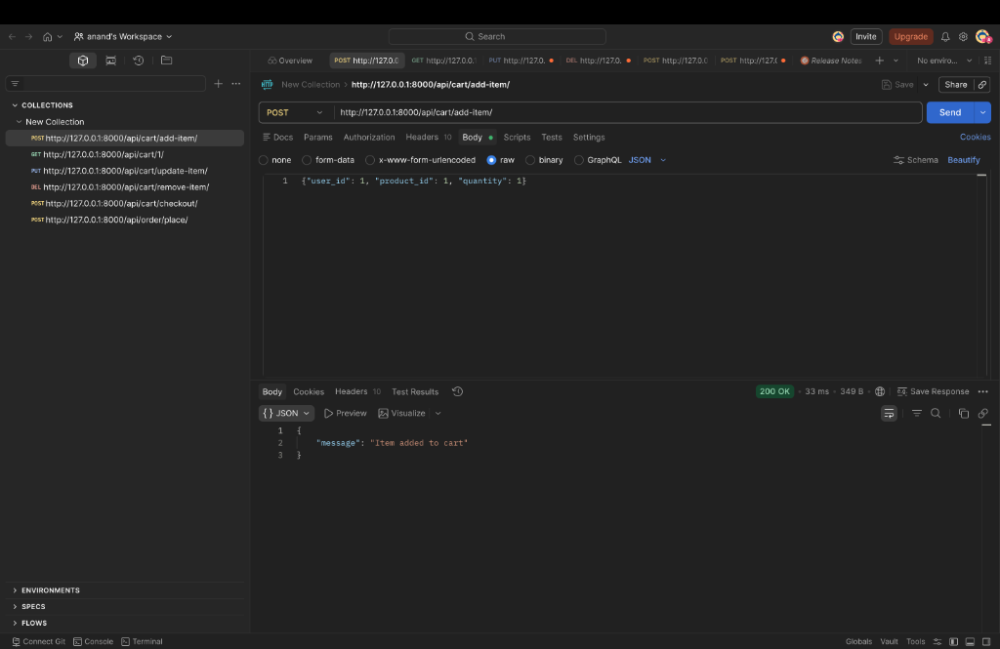
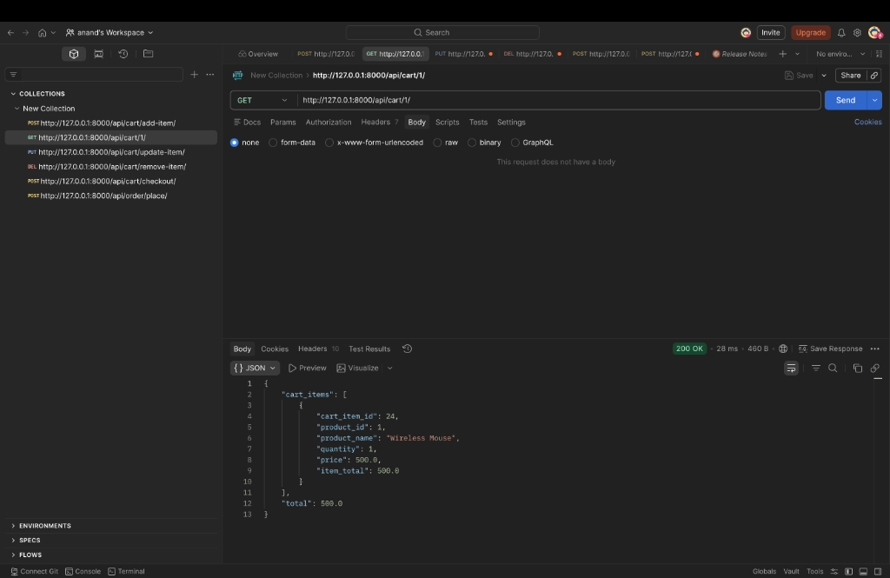
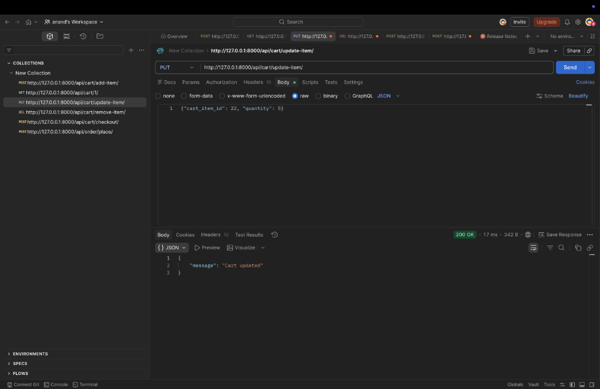
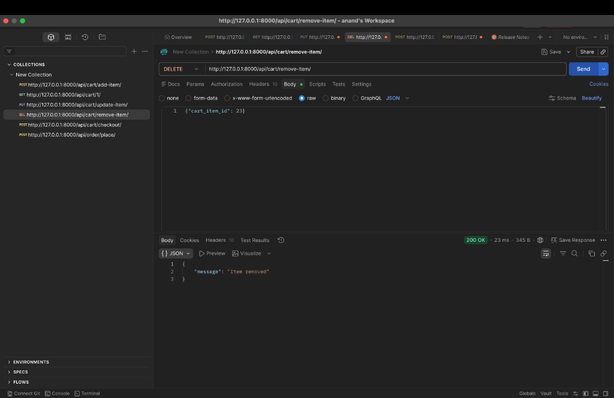
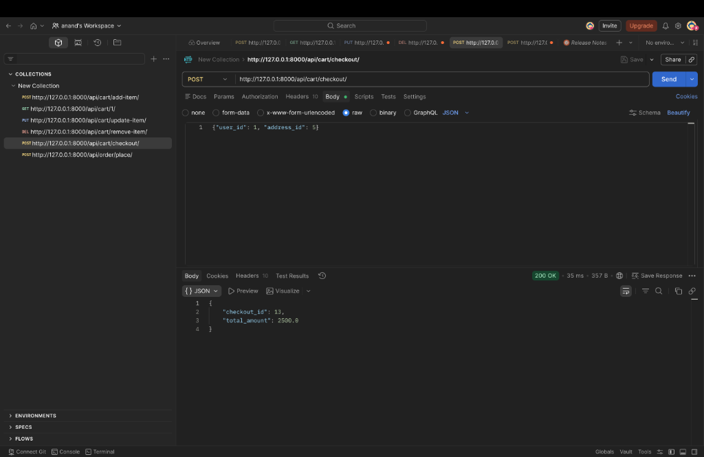
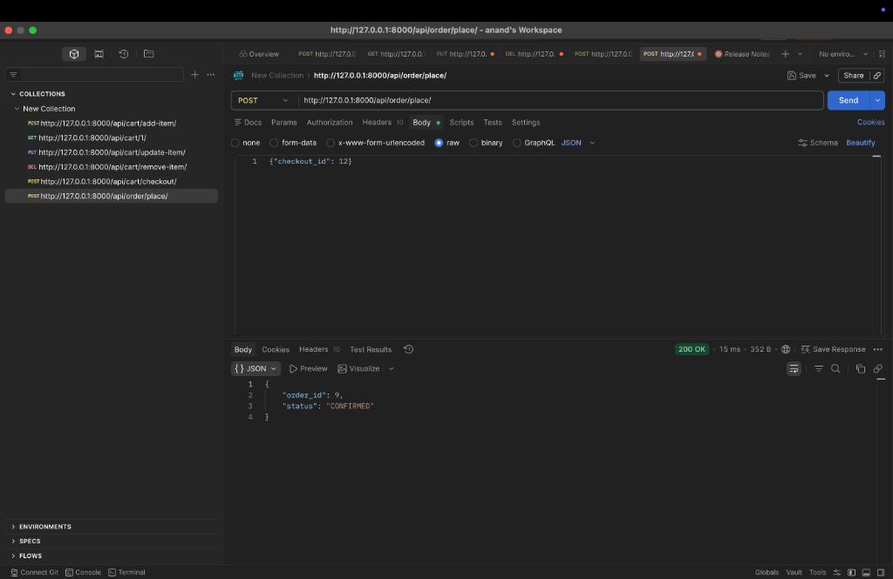

# Spinny Assignment - Shopping Cart API
A Django REST Framework application implementing a shopping cart with 6 endpoints for adding items, getting cart details, updating item quantity, removing items, checkout, and placing orders.

## Technologies Used
- Python 3.x
- Django 4.x
- Django REST Framework (DRF)
- SQLite3 (default database)
- Clean Architecture (Services layer)

## How to Run Locally

### 1. Install Requirements
```bash
pip install -r requirements.txt
```

### 2. Make Migrations
```bash
python manage.py makemigrations
python manage.py migrate
```

### 3. Seed the Database
*(This command creates a sample user (ID=1) and 5 sample products for testing).*
```bash
python manage.py seed_data
```

### 4. Run the Server
```bash
python manage.py runserver 8000
```

## API Postman Screenshots

### 1. Add Item to Cart (POST)


### 2. Get Cart Items (GET)


### 3. Update Cart Item (PUT)


### 4. Remove Item (DELETE)


### 5. Checkout (POST)


### 6. Place Order (POST)

